## Part 1. Готовый докер

- **Взял официальный докер образ с nginx и выкачал его при помощи `docker pull`**
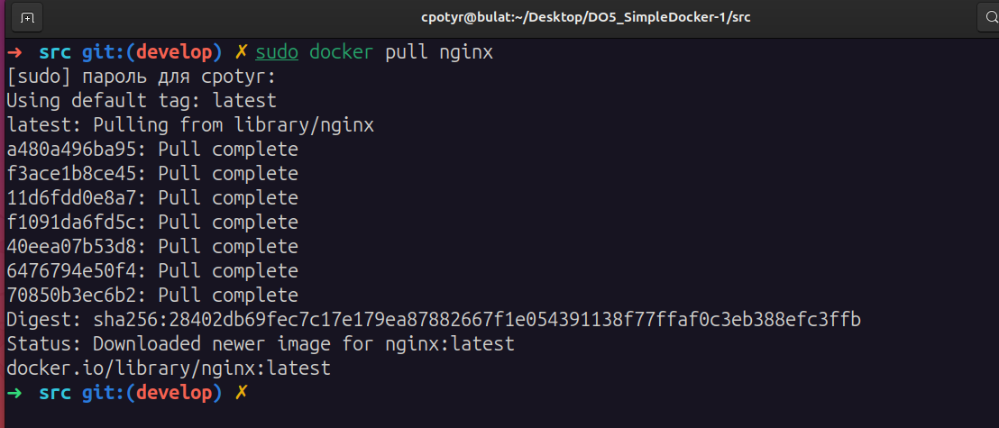
- **Проверил наличие докер образа через `docker images`** 
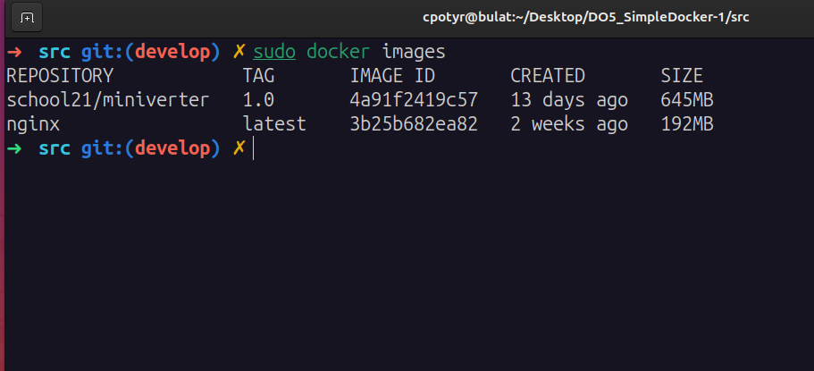  

- **Запустил докер образ через `docker run -d [image_id|repository]`**
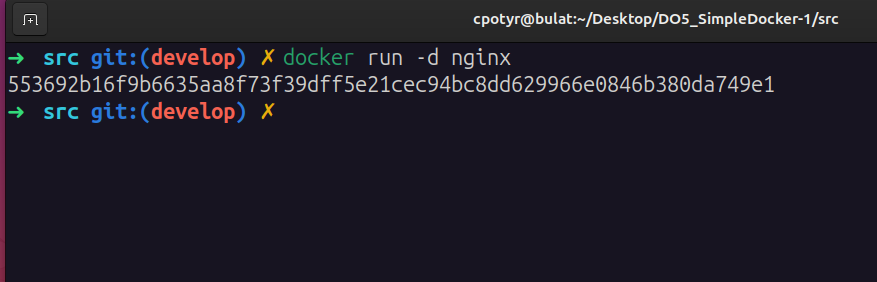
> **-d:** указывает на запуск контейнера в фоновом режиме (detached). Это означает, что контейнер будет работать в фоновом режиме.

- **Проверил, что образ запустился через `docker ps`**
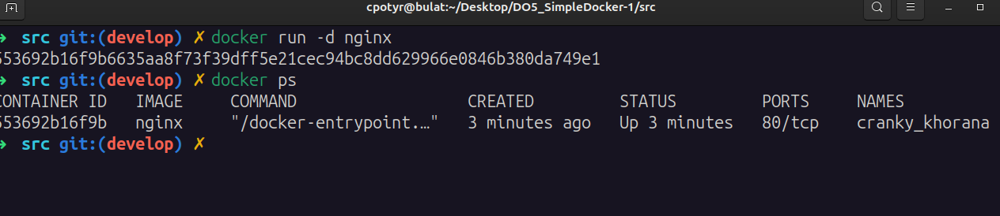
>Команда `docker ps` используется для вывода списка запущенных контейнеров Docker.  (docker process)


- **Посмотрел информацию о контейнере через `docker inspect [container_id|container_name]`**
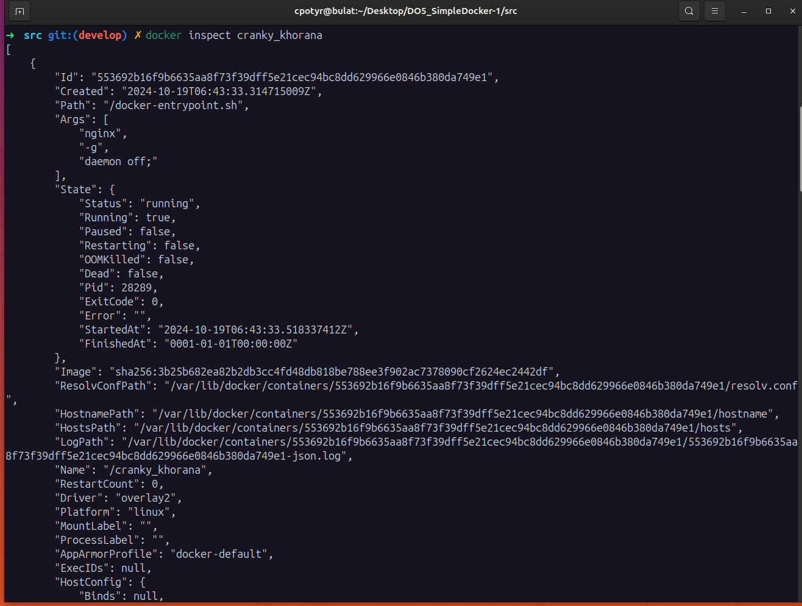
- размер контейнера:
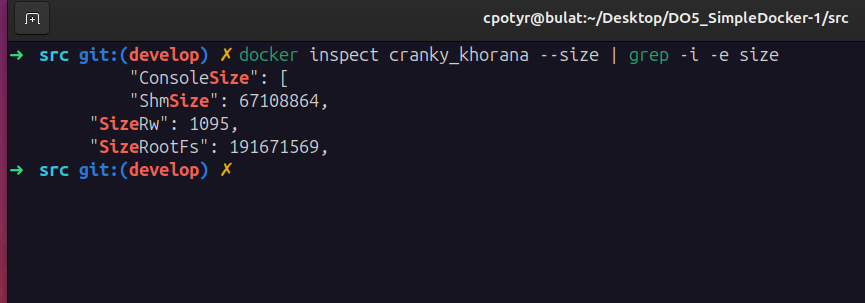
- список замапленных портов:  
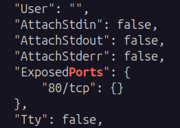
- ip контейнера:  
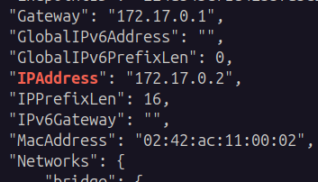  

- **Остановил докер образ через `docker stop cranky_khorana` (имя моего контейнера):
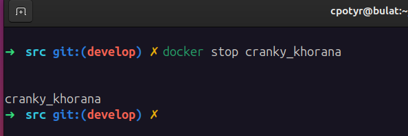  
- Проверил, что образ остановился через `docker ps`  
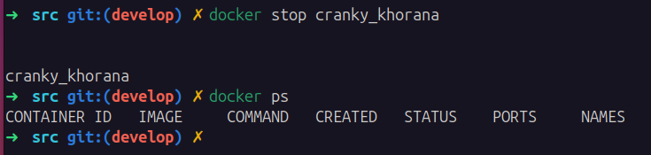  

- **Запустил докер с портами 80 и 443 в контейнере, замапленными на такие же порты на локальной машине, через команду `run`** 
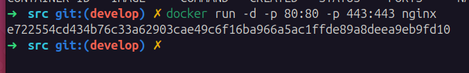  

- **Проверил, что в браузере по адресу *localhost:80* доступна стартовая страница `nginx`** 
- 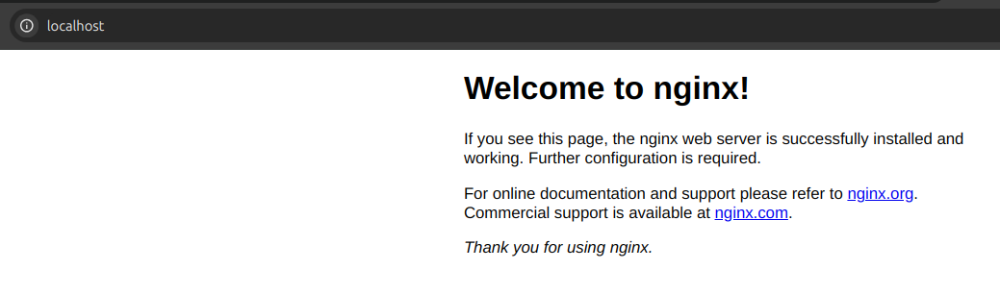  
 
- **Перезапустил докер контейнер через `docker restart [container_id|container_name]` и проверили, что контейнер запустился**  
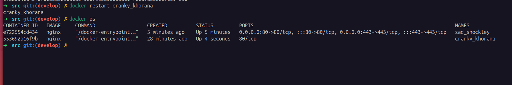  

---

## Part 2. Операции с контейнером

- **Прочитал конфигурационный файл `nginx.conf` внутри докер контейнера через команду `docker exec cranky_khorana cat /etc/nginx/nginx.conf`** 

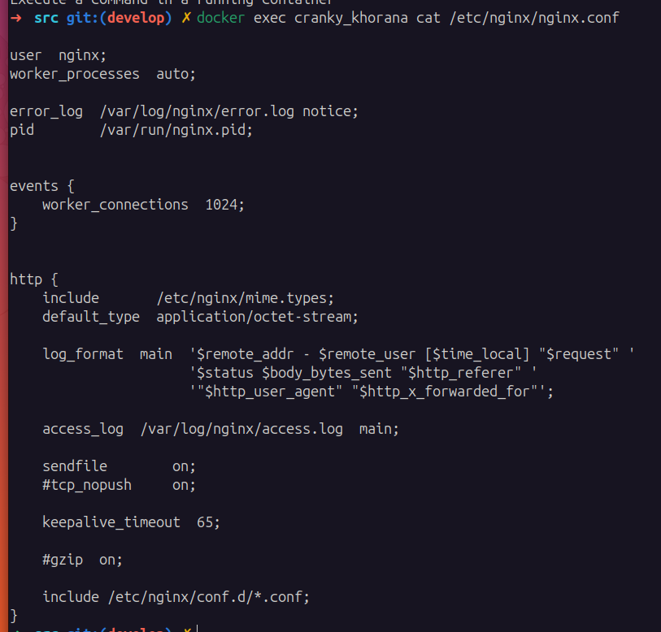  

- **Создал на локальной машине файл `nginx.conf`**
`vim nginx.conf`  
- **Настроил в нем по пути `/status` отдачу страницы статуса сервера `nginx`**: 
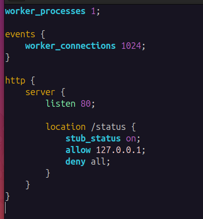  

Это минимальный конфиг, который делает следующее:

- listen 80; — сервер слушает порт 80.
- В блоке location /status {} задается доступ к странице статуса.
- stub_status on; — включает статусную страницу.
- allow 127.0.0.1; — разрешает доступ только с локального хоста.
- deny all; — запрещает доступ всем остальным.  

- **Скопировали созданный файл `nginx.conf` внутрь докер образа через команду `docker cp`**  
 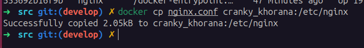  

- **Перезапустил `nginx` внутри докер образа через команду `exec`**  
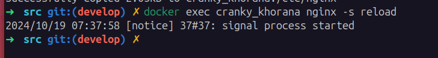  

- **Проверил, что по адресу `localhost:80/status` отдается страничка со статусом сервера `nginx`** 
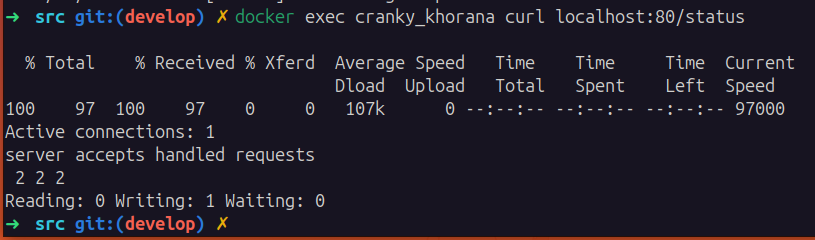
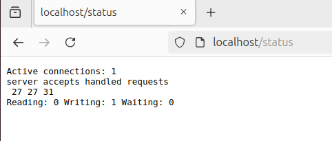  

- **Экспортировал контейнер в файл `container.tar` через команду `export`и остановили контейнер**  
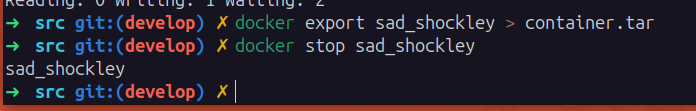  

- **Удалил образ через `docker rmi [image_id|repository]`, не удаляя перед этим контейнеры** 
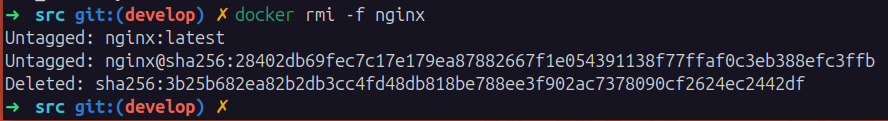  

- **Удалил остановленный контейнер**  
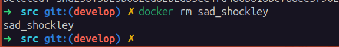  

- **Импортировал контейнер обратно через команду `import`**  
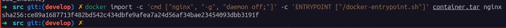  


- **Запустил импортированный контейнер** 
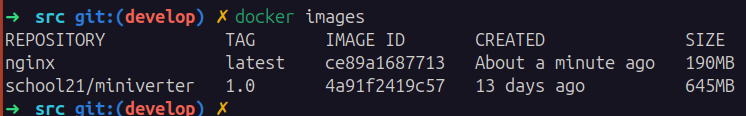  
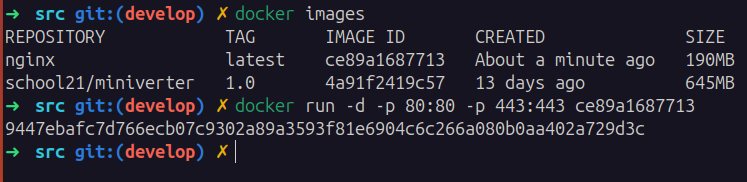  

- **Проверил, что по адресу `localhost:80/status` отдается страничка со статусом сервера `nginx`**  
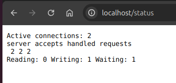  
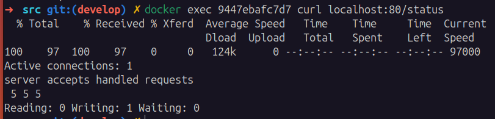  

---

## Part 3. Мини веб-сервер

- **Написал мини сервер на C и FastCgi, который будет возвращать простейшую страничку с надписью Hello World!** 
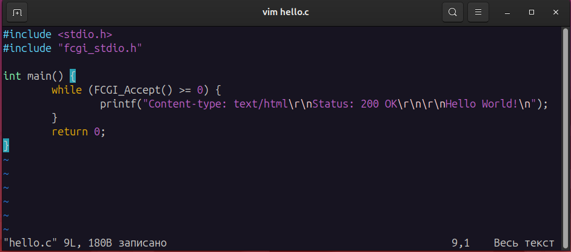  

- **Написал свой nginx.conf, который будет проксировать все запросы с 81 порта на 127.0.0.1:8080**  
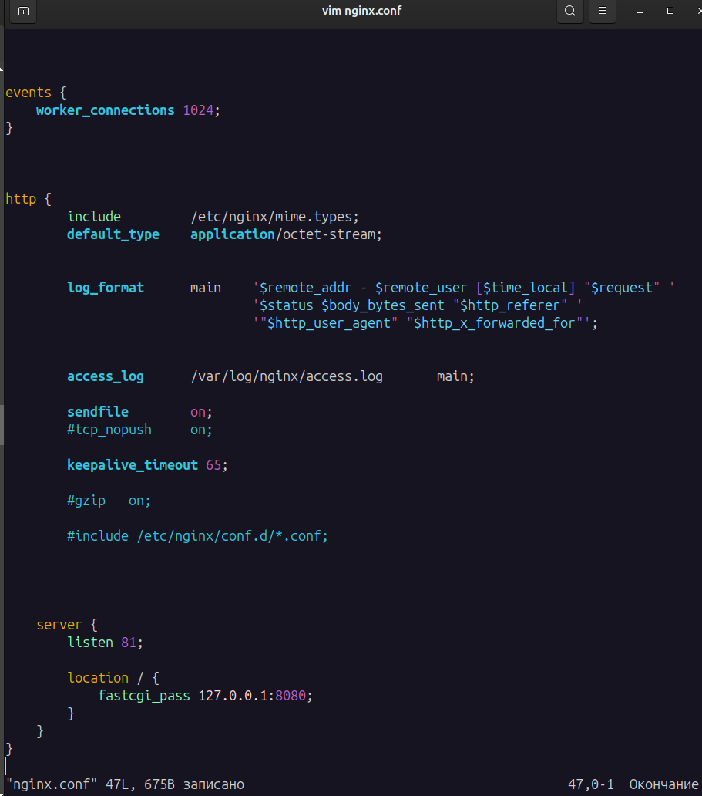 

- Скопировал созданный nginx.conf и мини сервер в контейнер и зашел в него. 
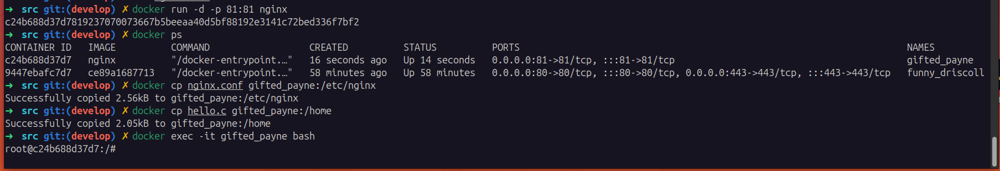 

- Установил требуемые ПО: 
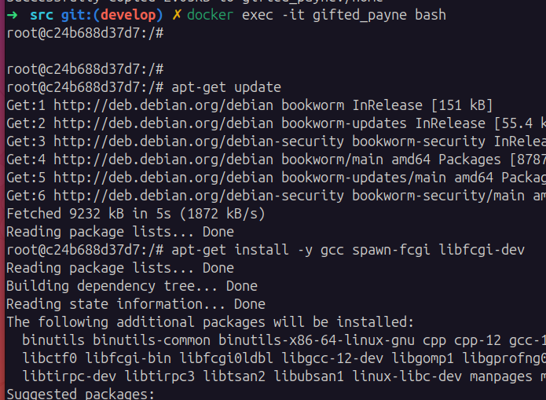  

- Скомпилировал и **запустил написанный мини сервер через spawn-fcgi на порту 8080** 
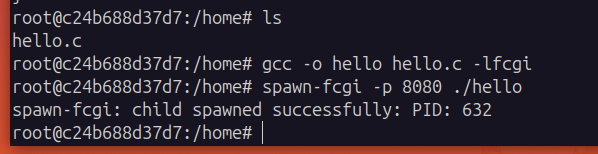 

- **Проверил, что в браузере по localhost:81 отдается "Hello World!"** 
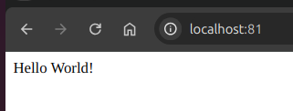  

- **Положил файл nginx.conf по пути ./nginx/nginx.conf:**
`docker cp nginx.conf gifted_payne:/etc/nginx/nginx.conf`  
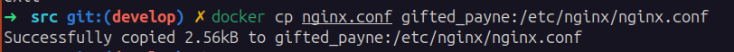  

## Part 4. Свой докер
- **Написал свой докер образ, который:**
	- собирает исходники мини сервера на FastCgi из [Части 3](#part-3-мини-веб-сервер)
	- запускает его на 8080 порту
	- копирует внутрь образа написанный ./nginx/nginx.conf
    - запускает nginx.
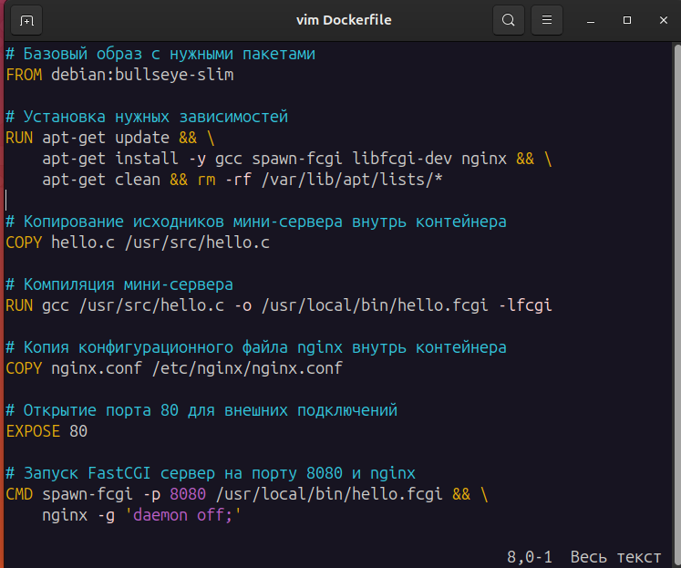

Dockerfile с объяснениями каждой строчки:
```Dockerfile
# Базовый образ с нужными пакетами
# использую легковесный образ Debian.
FROM debian:bullseye-slim

# Установка нужных зависимостей
RUN apt-get update && \
    apt-get install -y gcc spawn-fcgi libfcgi-dev nginx && \
    apt-get clean && rm -rf /var/lib/apt/lists/*

# Копирование исходников мини-сервера внутрь контейнера
COPY hello.c /usr/src/hello.c

# Компиляция мини-сервера
RUN gcc /usr/src/hello.c -o /usr/local/bin/hello.fcgi -lfcgi

# Копия конфигурационного файла nginx внутрь контейнера
COPY nginx.conf /etc/nginx/nginx.conf

# Указываю Docker, что контейнер будет слушать порт 80.
EXPOSE 80

# Запуск FastCGI сервер на порту 8080 и nginx
CMD ["sh", "-c", "spawn-fcgi -p 8080 /usr/local/bin/hello.fcgi && nginx -g 'daemon off;'"]
```

В докере предпочтительно запускать сервисы через команды, которые блокируют основной процесс контейнера Поэтому: `nginx -g 'daemon off;` Эта команда запускает nginx в приоритетном-режиме, что предпочтительнее в контейнерных средах, так как поддерживает жизнеспособность основного процесса. Это гарантирует, что процесс контейнера будет жить до тех пор, пока работает nginx. Контейнер завершится, если основной процесс завершится.

- **Собрал написанный докер образ через docker build при этом указав имя и тег**  
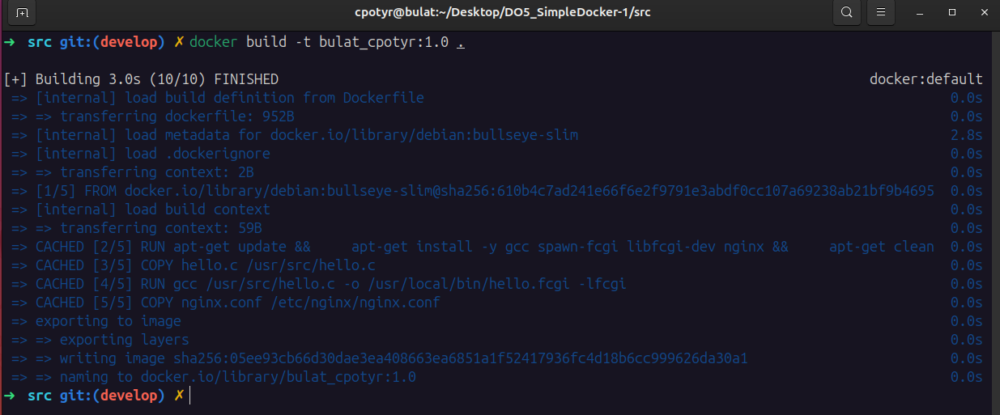  

- **Проверил через docker images, что все собралось корректно**
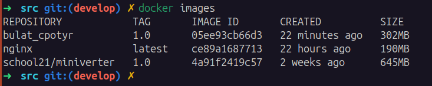  

- **Запустил собранный докер образ с маппингом 81 порта на 80 на локальной машине и маппингом папки ./nginx внутрь контейнера по адресу, где лежат конфигурационные файлы nginx'а**  
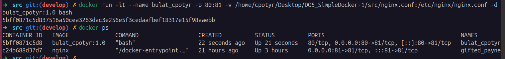  
	> - **-p 81:80** - это опция для маппинга портов. Она указывает, что порт 80 на локальной машине будет проксироваться на порт 81 внутри контейнера.
	> - **-v** - это опция для маппинга папки. Она указывает, что текущая папка `/home/cpotyr/Desktop/DO5_SimpleDocker-1/src/nginx.conf` на локальной машине будет монтироваться в путь `/etc/nginx/nginx.conf` внутри контейнера.
	>

- **Проверил, что по localhost:80 доступна страничка написанного мини сервера:**  
